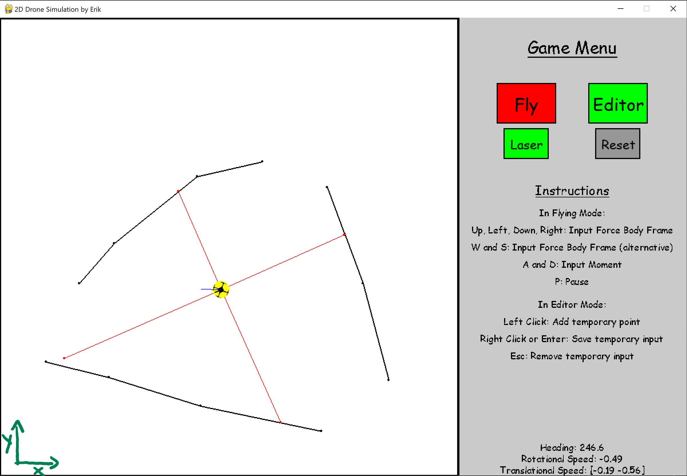

# 2d Drone Flying Simulation with PyGame

This is a 2D Drone simulation, where the user is able to fly and control a drone. The flight physics are very simplified. This program is only used for teaching purpose and was developed during visiting the lecture "Flight Simulation" at the TU Berlin. The most important features are:
- Flying the drone manually
- Clear Interfaces
- Editor Mode for adding walls
- Artificial Measurements



Enjoy! :)

## Quickstart guide

Make sure to have Python 3.8 or higher installed (although this should also run with Python 3.5 or higher). 
Navigate to your desired location and clone this repository:

```bash
git clone https://github.com/Erikx3/2D_Pygame_Drone_Simulation.git
```

Don't forget to install the necessary packages, if you do not have them:
```bash
pip install -r requirements.txt
```

Now simply run _main.py_ and enjoy flying!

## Settings

You are able to change some settings for the drone in _drone.py_ and some general settings in _environment.py_. You will find these settings in bold on top of each script!

## Structure

In case further students would like to use this program, this section provides a short overview about the structure of this program and how to connect a further script to enable automatic flight.

This program consists of three main classes:

- _environment.py_: Foundation for drone and obstacles and user interface
- _drone.py_: Drone including physics and drawing methods
- _obstacles.py_: Class to represent obstacles (walls)

The drone and obstacles are living on the environment. The environment is divided in the playground and menu section as seen in the screenshot above. It is important to note, that for the playground an own coordinate systems has been introduced in meters at the bottom left, also indicated in the screenshot at the top.
This is also the navigation frame used. Transforming between this coordinate frame and the pygame coordinate frame is provided in _environment.py_ and must be done for drawing.

If you would like to write an external script without touching the actual game for testing some autonomous functions on the drone, I provided the following functions and measurement units as an interface:

Function to apply forces for steering the drone:
```python
def apply_forces(self, F, M):
    """
    This function should be used as an interface for other programs later to apply forces on drone

    :param F: Translational Force as 2-dim array [N]
    :param M: Rotational Force as 1 dim [Nm]
    """
        
# Example to call this in the external script:
drone.apply_forces(F=[1,0.5], M=0.5)
```

Function to access measurements:
```python
drone.IMU.get_current_meas()
drone.Laser.get_current_meas()
# or
drone.IMU.get_all_meas()
drone.Laser.get_all_meas()
```

Please note, that the measurements have their own logging rate. To change these, look at the initialization of the drone.

You are welcome for contributions in any directions, next bullet points are:
- enhance flight physics
- add some fun game features (like scoreboard and gathering coins)
- try autonomous flight script and some algorithms
- provide function to load given map and save created map
- ...